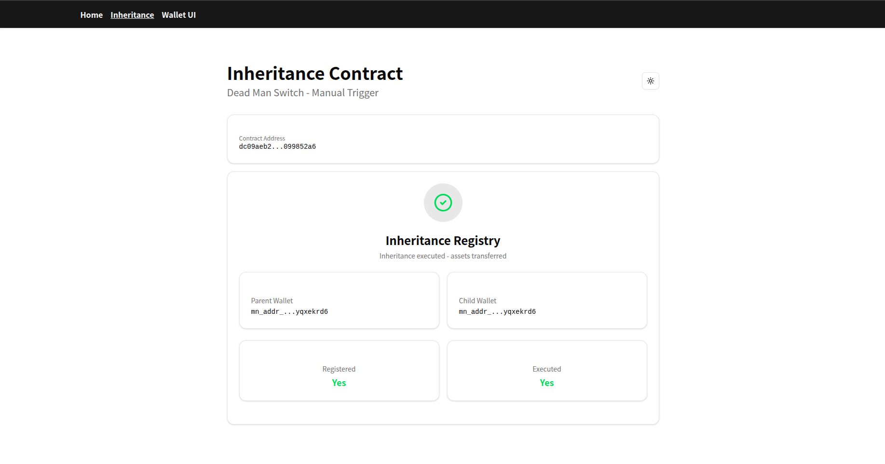

# Midnight Inheritance Contract

Dead Man Switch implementation on Midnight Network - manual trigger inheritance system.



## Overview

Manual trigger inheritance contract where:
- **Parent** registers themselves + child wallet
- **Anyone** can trigger `execute()` to transfer assets to child
- One-time execution lock prevents re-triggering

No heartbeats, no timers - just event-triggered inheritance.

## Project Structure

```
├── inheritence-contract/    # Compact smart contract + deploy script
├── inheritence-cli/         # CLI tools & docker configs
└── frontend-vite-react/     # React frontend (Vite + TanStack Router)
```

## Prerequisites

- [Node.js](https://nodejs.org/) v23+ / [Bun](https://bun.sh/)
- [Docker](https://docs.docker.com/get-docker/)
- [Git LFS](https://git-lfs.com/)
- [Compact Tools](https://docs.midnight.network/relnotes/compact-tools)
- [Lace Wallet](https://chromewebstore.google.com/detail/hgeekaiplokcnmakghbdfbgnlfheichg) (browser extension)

## Quick Start

### 1. Install Compact

```bash
curl --proto '=https' --tlsv1.2 -LsSf \
  https://github.com/midnightntwrk/compact/releases/latest/download/compact-installer.sh | sh

compact update +0.27.0
```

### 2. Install Dependencies

```bash
# Contract
cd inheritence-contract && bun install

# Frontend
cd ../frontend-vite-react && bun install
```

### 3. Compile Contract

```bash
cd inheritence-contract
bun run compile   # compiles .compact → keys/zkir
bun run build     # compiles typescript
```

### 4. Deploy Contract

Start local network or use preview network:

```bash
# Local (undeployed) - requires docker
cd inheritence-cli
docker compose -f standalone.yml up -d

# Then deploy
cd ../inheritence-contract
bun run deploy
```

Deployed contract address saved to `inheritence-contract/deployment.json`

### 5. Configure Frontend

```bash
cd frontend-vite-react

# Set contract address in .env
echo 'VITE_INHERITANCE_CONTRACT_ADDRESS="<your-contract-address>"' > .env
```

### 6. Run Frontend

```bash
bun dev
```

Open http://localhost:5173/inheritance

## Contract (inheritence.compact)

```compact
pragma language_version >= 0.20;
import CompactStandardLibrary;

export ledger parent: Bytes<32>;
export ledger child: Bytes<32>;
export ledger isRegistered: Boolean;
export ledger isExecuted: Boolean;

// Register parent + child addresses
export circuit register(parent_addr: Bytes<32>, child_addr: Bytes<32>): [] {
  assert(!isRegistered, "already registered");
  parent = disclose(parent_addr);
  child = disclose(child_addr);
  isRegistered = true;
}

// Execute inheritance - transfers assets to child
export circuit execute(): [] {
  assert(isRegistered, "not registered");
  assert(!isExecuted, "already executed");
  isExecuted = true;
}
```

### Circuits

| Circuit | Params | Description |
|---------|--------|-------------|
| `register` | `parent_addr`, `child_addr` | Store wallet mappings, lock registration |
| `execute` | none | Mark executed, trigger asset transfer |

## Frontend Pages

| Route | Description |
|-------|-------------|
| `/` | Redirects to /inheritance |
| `/inheritance` | Main contract UI - register/execute |
| `/wallet-ui` | Wallet connection details |

## Environment Variables

### inheritence-contract/.env

```bash
INDEXER_URL=http://127.0.0.1:8088/api/v3/graphql
INDEXER_WS_URL=ws://127.0.0.1:8088/api/v3/graphql/ws
NODE_URL=http://127.0.0.1:9944
PROOF_SERVER_URL=http://127.0.0.1:6300
NETWORK_ID=undeployed
```

### frontend-vite-react/.env

```bash
VITE_INHERITANCE_CONTRACT_ADDRESS="<deployed-contract-address>"
```

## Network Options

| Network | Config |
|---------|--------|
| Local (undeployed) | `docker compose -f standalone.yml up` |
| Preview | Use [faucet](https://faucet.preview.midnight.network/) for tNight |
| Preprod | Use [preprod faucet](https://faucet.preprod.midnight.network/) |

## Known Issues

- arm64 Docker proof server bug - use `bricktowers/proof-server:6.1.0-alpha.6`

## Tech Stack

- **Contract**: Midnight Compact
- **Frontend**: React 19 + Vite + TanStack Router
- **Styling**: Tailwind CSS 4 + Radix UI
- **Wallet**: Midnight Lace integration via dapp-connector

## TODO

- [ ] Wire frontend to actual contract calls
- [ ] Add asset deposit functionality
- [ ] Multi-heir support
- [ ] Guardian/multisig trigger option

---

Built for Midnight Network
